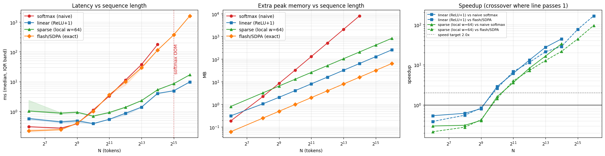
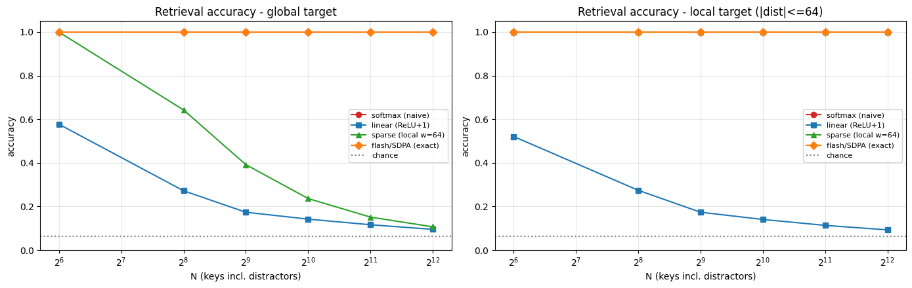

# Team 3 Attention Results Presentation Deck

**Title:** Linear vs Softmax vs Sparse vs Flash Attention: Measured Efficiency, Output Deviation, and Retrieval Quality  
**Team:** Team 3 | PDCA Research Workbook  
**Hardware & Environment:** NVIDIA Tesla T4 (16GB), float32, PyTorch 2.11.0+cu128  

---

## Slide 1: Title & Overview

### Linear vs Softmax vs Sparse vs Flash Attention
**Subtitle:** Measured efficiency, output deviation, and retrieval quality  
**Presenter:** Team 3  
**Venue / Context:** PDCA Research Workbook Evaluation  
**Benchmarking Environment:** NVIDIA Tesla T4, `torch.float32`, PyTorch 2.11  

---

## Slide 2: What We Compared

### Controlled Layer-Level Setup
All methods evaluated with identical inputs $Q, K, V$ and shared dimensions:
- **Batch Size ($B$):** 1
- **Attention Heads ($H$):** 4
- **Key Dimension ($d_k$):** 64
- **Value Dimension ($d_v$):** 64
- **Feature Rank ($r$):** 64 (for $\text{ReLU}+1$)

| Method | Exact Softmax? | Time Complexity | Memory Complexity (Intermediate) |
| :--- | :--- | :--- | :--- |
| **Softmax (Naive)** | Yes | $O(N^2 d)$ | $O(N^2)$ pairwise attention matrix |
| **Flash / SDPA** | Yes | $O(N^2 d)$ | $O(N)$ (memory-efficient tiled exact kernel) |
| **Sparse (Local, $w=64$)** | No (nearby keys only) | $O(N w d)$ | $O(N w)$ windowed intermediate |
| **Linear ($\text{ReLU}+1$)** | No (different kernel) | $O(N r d_v)$ | $O(r d_v)$ recurrent compact state |

### Verification Milestones Passed Prior to Timing:
1. **Corrected 3-token example:** Linear attention output confirmed at $[4.8, 5.2]$ vs exact scaled softmax $[4.280169, 5.719831]$.
2. **Associativity equivalence:** Explicit kernel ($K$) vs reordered linear ($L$) agree to machine precision ($\max|K - L| \approx 2.78 \times 10^{-16}$).
3. **Causal leakage test:** Future key/value modifications did not affect earlier tokens ($\Delta_{\le t_0} = 0.00$).
4. **Hardware note:** On Turing (Tesla T4), SDPA runs PyTorch's memory-efficient exact kernel (FlashAttention-2 requires Ampere+ and FP16/BF16).

---

## Slide 3: Efficiency — Linear Wins on Speed and Memory from $N = 1,024$

### Latency, Extra Peak Memory, and Speedup ($N = 64$ to $65,536$)

### Key Metrics:
- **$9.74\text{ ms}$:** Linear Attention latency at $N = 65,536$ (vs **$1,601.74\text{ ms}$** for Flash/SDPA — a **$164.4\times$ speedup**).
- **OOM at $N = 32,768$:** Naive Softmax runs out of memory on the 16GB T4.
- **$257.1\text{ MB}$:** Linear attention peak memory at $N = 65,536$ vs **$8,208\text{ MB}$** for Naive Softmax at $N = 16,384$.
- **$0.54\times$ Speedup at $N = 64$:** Reordered linear attention is slower on short sequences ($N < 512$) due to feature projection overhead.

---

## Slide 4: Quality — The Speed Comes at a Large Retrieval Cost

### Key-Value Retrieval with Distractors ($C = 16$ Classes, Chance = $6.2\%$)

### Key Metrics:
- **$14.2\%$ Accuracy:** Linear Attention at $N = 1,024$ (Softmax achieves **$100\%$**; Chance is $6.2\%$).
- **$0.7903$ Output Error:** Linear relative Frobenius error vs Softmax at $N = 1,024$ ($\text{scale} = 1.0$).
- **$100\% \text{ vs } 23.7\%$:** Sparse attention at $N = 1,024$ for local targets ($100\%$) vs global targets ($23.7\%$).
- **Flash/SDPA Exactness:** Matches naive Softmax exactly (relative error $\approx 4.56 \times 10^{-7}$).

---

## Slide 5: Can Linear Attention Be Rescued?

### Increasing Feature Rank $r$ and Head Dimension $d$

#### 1. Feature Map & Rank Sweep ($N = 1,024$, Global Targets)
Larger rank $r$ expands the memory state $S \in \mathbb{R}^{r \times d_v}$ and increases compute cost:

| Variant | State Floats per Head | Retrieval Accuracy |
| :--- | :--- | :--- |
| **Linear FAVOR+ ($r=64$)** | 4,096 | $10.1\%$ |
| **Linear FAVOR+ ($r=256$)** | 16,384 | $15.6\%$ |
| **Linear FAVOR+ ($r=1024$)** | 65,536 | $26.7\%$ |
| **Linear ReLU+1 ($r=64$)** | 4,096 | $14.2\%$ |
| **Softmax (Exact)** | 131,072 | **$100.0\%$** |

*Takeaway:* Even a $16\times$ increase in state size ($r=1024$) reaches only $26.7\%$ retrieval accuracy.

#### 2. Signal-Strength Sweep (Key Norm Scale at $N = 1,024$)
- Softmax jumps from $32.4\%$ at scale 2 to $100.0\%$ by scale 8.
- Linear attention barely rises from $8.3\%$ to $17.5\%$ at scale 24.

#### 3. Head Dimension Sweep ($N = 4,096$, $d_k = d_v = r = d$)
- Softmax scales as $O(N^2 d)$, Linear scales as $O(N d^2)$.
- As $d$ grows from 16 to 512, Linear's speedup vs Softmax shrinks from $15.0\times$ down to $8.1\times$.

---

## Slide 6: Acceptance Test — No Method Wins on Both Speed and Quality

### Pre-Registered Criteria:
- **Speed:** Speedup $\ge 2.0\times$ vs naive softmax.
- **Quality Non-Inferiority:** Retrieval accuracy difference $\Delta = \text{acc}_{\text{method}} - \text{acc}_{\text{softmax}}$ has $95\%$ CI lower bound $> -\delta$ ($\delta = 0.05$).

| Method | Speedup at $N = 4,096$ | Quality Difference ($\Delta$) Global | Non-Inferiority ($> -0.05$)? | Combined Claim Status |
| :--- | :--- | :--- | :--- | :--- |
| **Linear (ReLU+1)** | **$12.97\times$** (Pass) | **$-0.905$** (Fail) | False (CI: $[-0.909, -0.900]$) | **FAILS** |
| **Sparse (Local $w=64$)** | **$8.14\times$** (Pass) | **$-0.893$** (Fail) | False (CI: $[-0.895, -0.891]$) | **FAILS (Global)** / **PASS (Local)** |
| **Flash / SDPA** | $1.14\times$ (Fail vs naive) | **$0.000$** (Pass) | True (CI: $[0.000, 0.000]$) | **Passes Quality Only** |

> **Critical Empirical Finding:**  
> Flash/SDPA is the true engineering control: it achieves $O(N)$ memory, never OOMs up to $N = 65,536$, and preserves $100\%$ exact retrieval. Linear attention's speedup cannot justify a $86\text{–}91\%$ drop in retrieval accuracy.

---

## Slide 7: Conclusions & Future Research Directions

### 1. Empirical Conclusions:
1. **Linear Scaling Confirmed:** Measured execution time slope is $\approx 0.80$ for Linear vs $1.81$ for Softmax. At $N = 65,536$, Linear is $164\times$ faster than SDPA.
2. **Severe Retrieval Bottleneck:** Compressing sequence history into a fixed-size $r \times d_v$ matrix causes catastrophic key collisions ($14\%$ at $N=1,024$).
3. **Exact Attention is Memory-Feasible:** Memory-efficient exact attention (SDPA/Flash) eliminates the $O(N^2)$ memory bottleneck without losing retrieval accuracy.
4. **Sparse is a Locality Bet:** Exact within local window ($w=64$), but chance-level for distant information.

### 2. Limitations:
- Single GPU (Tesla T4), `torch.float32`, synthetic random data, non-causal attention, no positional embeddings, single feature map family.

### 3. Next Steps & Research Pivot:
- **Adaptive Attention Computation:** Dynamically select feature rank $r \in \{64, 256, 1024\}$ based on token difficulty certificate.
- **Gated DeltaNet Baselines:** Incorporate data-dependent update gates and delta-rule error correction.
- **Model Patching:** Evaluate prefill and generation on pretrained `Qwen2.5-0.5B`.
