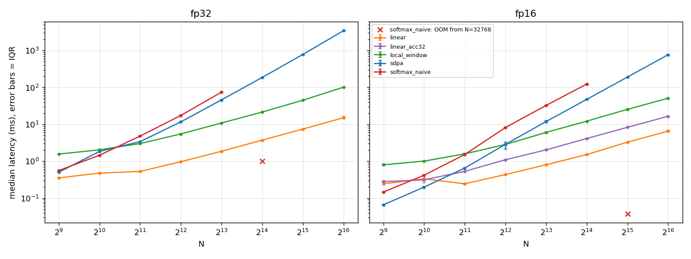
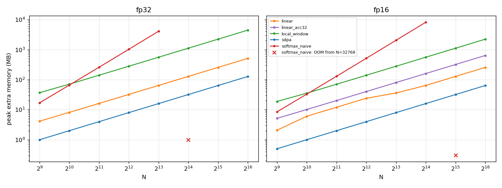
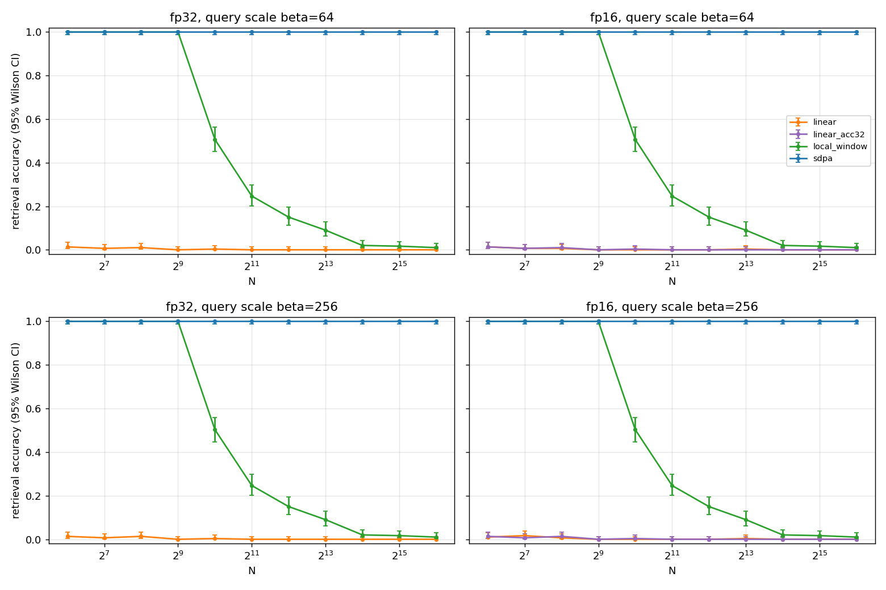
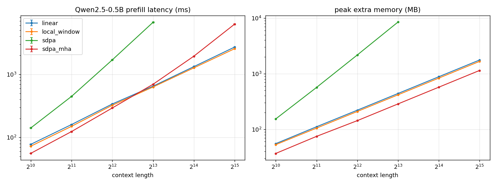
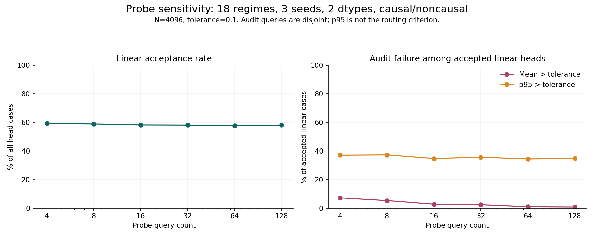
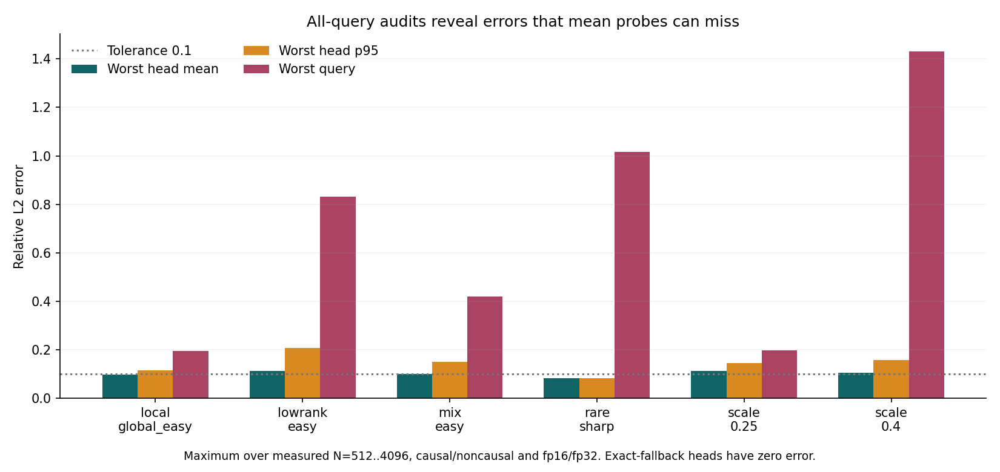

# Linear attention: what we tested, what worked, and what did not

A newcomer guide for another team. Measurements made on 5 October 2026; source snapshot `8096d83526f4d134778e438484fc02a5ff1f2af7`.

## Read this first

We asked whether cheaper attention can replace ordinary softmax attention as inputs get longer, and whether a router can choose a cheap approximation only when it looks accurate enough. We built and ran actual GPU benchmarks, a precise lookup task, swaps inside a pretrained language model, and a deeper router audit.

The outcome is a **mapped boundary, not a new successful model accelerator**. Basic linear attention can be much faster on long synthetic inputs, but loses precise lookup and badly hurts the tested model's language quality. Adaptive random-feature attention works on some mild synthetic inputs. The detailed router does not speed up Qwen2.5-0.5B at the tested lengths. A small average error on a few sampled queries does not guarantee safety for every query, and cached decisions fail under the tested distribution change.

No benchmark was rerun for this guide. All measured values below come from saved CSVs. The original Colab experiments and later detailed follow-up are different run cohorts; do not combine their timings or compare their perplexities as if the inputs and environments matched. The current detailed verdict in [SUMMARY.md](../SUMMARY.md) supersedes the older broad router wording in [README.md](../README.md).

## 1. The question in everyday language

Attention lets each token, such as a word fragment, decide which other tokens matter to its next representation. A **query** is what a token is looking for; a **key** describes what another token offers; a **value** is the information returned. An attention **head** is one parallel lookup mechanism inside a layer.

Ordinary softmax attention compares queries with keys and turns their scores into weights. It can place almost all the weight on one matching item. For a sequence of length N, all-pairs attention has roughly N squared comparisons: doubling the length roughly quadruples this part of the work. This is the meaning of O(N²), not a promise about observed total model runtime.

Kernelized linear attention first compresses keys and values into a reusable summary, then answers each query from that summary. At fixed feature width, work grows roughly in proportion to N, written O(N). Avoiding the all-pairs matrix may save time, but compression can blur a sharp lookup.

Our research question has two parts:

- Where does that saving stop being an acceptable substitute for exact attention?
- Can an **adaptive-rank router** choose the cheapest acceptable approximation separately for each input/head, and use exact attention when no approximation passes?

A rank here is the number of random features used to approximate the softmax kernel, not the number of model heads or a measured matrix rank. More features usually mean more work, but do not guarantee every input becomes accurate.

## 2. What was built

| Component | What it answers | Implementation |
| --- | --- | --- |
| Basic GPU harness | Time, memory, numerical failures and output differences | `run_efficiency.py`, `lab/attention.py`, `lab/timing.py` |
| Key-value retrieval | Can attention find one exact item among many distractors? | `run_retrieval.py` |
| Real pretrained model swap | What happens to speed and language quality inside a real model? | `run_qwen.py`, `lab/qwen_patch.py` |
| Initial adaptive router | Do different inputs need different feature counts? | `run_adaptive.py`, `lab/adaptive.py` |
| Detailed follow-up | Probe reliability, worst-query errors, crossover lengths and cache drift | `run_router_detailed.py`, `lab/router_detailed.py` |
| Reporting | Recreate plots/tables from saved measurements | `make_figures.py`, `make_report.py`, `make_router_detailed_report.py` |

### The methods are different, not interchangeable

- **Naive softmax** explicitly stores the query-key score matrix. It is a mathematical reference, not the best production baseline.
- **SDPA** is PyTorch's scaled dot-product attention API. PyTorch chooses an available backend. It computes exact softmax attention here without requiring our code to store the full score matrix. Do not describe every SDPA row as a verified FlashAttention run: the saved measurements do not identify a single backend for every row.
- **Local-window attention** restricts which keys a query can see. The code uses blocks of 256 positions and adjacent blocks; it is not arbitrary learned sparse attention. It can miss a matching item outside its window.
- **Basic linear attention** uses the positive feature map `relu(x)+1`. It changes the attention function; it is not the router's random-feature approximation. `linear_acc32` keeps fp16 inputs but adds sums in fp32 to reduce overflow.
- **Random-feature attention** approximates the softmax kernel with 64, 256 or 1024 positive random features and fp32 internal calculation. The router uses this family.

### The router's decision

For each batch element and head, compute exact attention for a sample of queries. Try ranks 64, 256 and 1024 in that order. Compare the candidate output with exact output using mean relative L2 error. This is the size of the difference vector divided by the size of the exact output vector, averaged over sampled queries. Choose the first rank within the tolerance, normally 0.1. That number is an output-vector error threshold, not a 10% language-quality guarantee.

The initial `adaptive_rank` variant forces rank 1024 if nothing passes and records `tol_not_met`. The initial `adaptive_rank_fb` variant instead uses exact attention. The original fallback implementation still computes full candidate outputs and uses dense exact fallback. The follow-up **probe-first** implementation tests sampled candidate rows and uses SDPA for exact fallback. Their costs differ, so their names cannot be substituted.

A **one-shot** decision pays selection cost for the current input. **Cached** execution reuses a previous rank assignment. The synthetic same-input cache is an idealized best case. Repeated-call tests actually make 2, 4 or 8 calls, paying selection once; reported per-call speed divides that measured total by call count. The Qwen cache requires a consistent assignment across two calibration windows, otherwise choosing exact attention. It does not include a deployment-ready drift detector.

## 3. How measurements were made

**Reading the configuration:** fp16 and fp32 mean 16-bit and 32-bit floating-point numbers: fp16 uses less space but has a smaller numerical range. Causal attention cannot see future tokens; noncausal attention can use the whole supplied sequence. A warmup runs code before the measured repetitions. A median is the middle observed time; quartiles show the middle half of repeated times. A seed makes random inputs repeatable. Prefill processes an existing prompt; decode generates later tokens one at a time. A tolerance is a threshold, not a statistical confidence level. A regime is a defined family of synthetic inputs. SDPA is PyTorch's optimized exact attention interface, not a separate learned model.


All recorded GPU runs used a Tesla T4. CUDA events timed GPU calls after warmups; CSVs retain median, lower/upper quartiles, repetitions and sometimes wall-clock time. Memory is PyTorch peak allocated memory, not a guessed VRAM formula: `peak_extra_mb` subtracts allocation before the call, including inputs; `peak_total_mb` is the total allocated peak. Despite the column suffix, code divides by 2²⁰, so these values are MiB. They are not system-wide reserved memory or a full deployment budget.

A successful call can still return invalid values. The harness records output finiteness separately. `oom` means out of GPU memory; blank timing is unavailable, not zero. Numerical errors and OOMs remain in the records rather than being replaced by estimates.

### Original Colab cohort

Environment: Python 3.13.15, torch 2.11.0+cu130, CUDA 13.0, transformers 5.17.0. Manifests: `results/run_config_*.json`. Their dirty-checkout flags are retained, not concealed.

| Stage | Exact setup |
| --- | --- |
| Basic efficiency | Noncausal; batch 1, 8 heads, head dimension 64; fp16/fp32; N=512,1024,2048,4096,8192,16384,32768,65536; seed 0; block 256; nominally 3 warmups, 20 repetitions, reduced to 7 for slow calls (actual warmups/repetitions are in each CSV row); exact-output comparison through N=4096 |
| Retrieval | N=64,128,256,512,1024,2048,4096,8192,16384,32768,65536; dimension 64; 300 trials per cell; seed 1234; batch 20; query scales beta=64 and 256; fp16/fp32; trial seeds derived from seed, N and trial |
| Initial Qwen swap | Pretrained Qwen/Qwen2.5-0.5B, fp16; N=1024,2048,4096,8192,16384,32768; 2 warmups, 7 timed repetitions; WikiText-2 test quality at context 2048, 16 windows |
| Initial adaptive | Seed 1234; ranks 64/256/1024; 16 probes; default tolerance .1, additional .05/.2/.4; N=1024,4096,16384,65536; small/mixed/large synthetic scales; nominally 3 warmups, 15 repetitions, with slow-call reductions recorded per row; retrieval 200 trials, N=256,1024,4096,16384,65536, beta=16/64/256; Qwen timing at 1024..8192 and quality on 8 windows at 2048 |

Original Qwen quality uses the first corpus windows; later detailed quality skips two calibration windows. The different window sets and environments explain why baseline values should not be pooled. The earlier adaptive synthetic regimes were changed after an initial unit-Gaussian run failed at every rank. That first run is not reported; this is an exploratory choice disclosed in the README, not a prespecified universal comparison.

### Detailed follow-up cohort

Environment: Python 3.13.15, torch 2.11.0+cu128, CUDA 12.8, transformers 5.16.1. Initial source commit `68960ab`. See the two stage manifests and preserved source hashes.

- Synthetic sensitivity: N=4096, batch 1, 8 heads, dimension 64; 18 regimes, causal/noncausal, fp16/fp32 and seeds 1234/2345/3456. Regimes include Gaussian query/key scales .1/.2/.25/.3/.4/.5/.75/1; easy/broad head mixtures; low-rank, clustered, smooth local/global and rare-sharp/shifted rare-sharp patterns.
- Tolerances: .01/.025/.05/.075/.1/.15/.2/.3/.4. Probe counts: 4/8/16/32/64/128. Accuracy audits use 256 disjoint query rows, never the selection probes. There are 93,312 sensitivity decision records and 5,184 rank-error records, not that many independent GPU runs.
- Scaling: six fixed regimes (`scale_0.25`, `scale_0.4`, `mix_easy`, `lowrank_easy`, `local_global_easy`, `rare_sharp`); eight lengths 512 through 65536; both masks/dtypes; timing seed 1234; .1 tolerance and 16 probes. One warmup, nominally five repetitions, reduced to three for slow calls. Actual counts are in each row. There are 2,112 timing records and 6,912 mixed scaling/head/cache-audit records. All-query audits exist only for N<=4096.
- Qwen activations: actual model query/key/value tensors after rotary position encoding and key/value-head expansion, captured from layers 0/6/12/18/23 on four windows. These are not Qwen-shaped random tensors.
- Qwen quality: 16 held-out test windows of context 2048 after two calibration windows, 32,752 next-token targets scored. Same evaluation windows for every detailed variant. Model revision and corpus-token hash are saved in `qwen_data_manifest.json`.
- Qwen timing: 1024/2048/4096/8192 tokens, one warmup and nominally five repetitions. It times the transformer body returning hidden states, excluding the output vocabulary head. It is not token generation, end-to-end inference or decode.

## 4. Basic speed and memory: cheap computation is real

At N=65,536, the original noncausal attention-only harness measured:

| dtype | method | median ms | extra allocated MiB | finite output |
| --- | --- | --- | --- | --- |
| fp32 | sdpa | 3,446.222 | 128.0 | True |
| fp32 | local_window | 101.698 | 4,483.2 | True |
| fp32 | linear | 15.144 | 514.1 | True |
| fp16 | sdpa | 771.616 | 64.0 | True |
| fp16 | local_window | 51.081 | 2,242.7 | True |
| fp16 | linear | 6.546 | 257.1 | False |
| fp16 | linear_acc32 | 16.562 | 642.1 | True |

Source: [efficiency.csv](../results/efficiency.csv), filter N=65536 and status=ok. Finite-output failures are deliberately shown. Pure fp16 linear attention is fast but becomes nonfinite at N=32768 and 65536; accumulating in fp32 stays finite in this run. Naive softmax first OOMs at N=16384 in fp32 and N=32768 in fp16.

The important memory comparison is with optimized exact SDPA, not only naive softmax. At this length SDPA's measured extra allocation is smaller than basic linear attention's in both dtypes. A linear-time formula does not imply less memory than an optimized exact kernel in this implementation.




## 5. Retrieval: speed does not preserve exact lookup

Each trial creates random unit-length keys and values. The query equals one key, multiplied by beta to sharpen the softmax lookup. Success means the returned vector is closest by cosine similarity to the matching value among all values. Methods receive identical seeded trials. This is a targeted test of lookup, not a full language task.

For fp32, beta=64:

| N | SDPA successes / 300 | local-window / 300 | linear / 300 |
| --- | --- | --- | --- |
| 1024 | 300 | 152 | 1 |
| 4096 | 300 | 45 | 0 |
| 65536 | 300 | 3 | 0 |

Source: [retrieval.csv](../results/retrieval.csv); the stated dtype/beta are part of the row selector. Other settings must not be silently substituted. SDPA achieved 300/300 across all tested retrieval settings. Wilson 95% intervals and seeded bootstrap intervals are saved, together with each trial's 0/1 outcome. At 0/300, the Wilson upper bound is about 1.26%; zero observed successes is not proof that true success probability is exactly zero.

Local attention misses distant items by design. Basic linear attention mixes information too broadly for this task. This maps a functional boundary: a long-context speed claim alone cannot stand in for sharp selection ability.



## 6. Real-model swaps: accuracy must be measured, not assumed

We replaced attention in pretrained Qwen2.5-0.5B without training or fine-tuning. **Perplexity** measures how surprised the model is by the next token; lower is better on the same corpus/windows. It is not a direct percentage of wrong answers.

Original 16-window test, context 2048:

| variant | perplexity | nonfinite windows |
| --- | --- | --- |
| sdpa | 12.64966 | 0 |
| sdpa_mha | 12.64988 | 0 |
| local_window | 61.38022 | 0 |
| linear | 4,532.95279 | 0 |

Source: [qwen_quality.csv](../results/qwen_quality.csv). The local-window and basic linear swaps damage language quality. This is evidence against an untrained substitution in this model, not against linear-attention models trained from scratch.

The original transformer SDPA path with grouped key/value heads was much slower on T4 than the explicitly head-expanded `sdpa_mha` path in this setup. Comparisons should use the matched efficient exact baseline, not select the slowest exact implementation to inflate a speedup. Timings and allocated memory are in [qwen_prefill.csv](../results/qwen_prefill.csv).



## 7. Initial adaptive evidence, before the stricter audit

On small-scale fp32 synthetic inputs at N=65536, `adaptive_rank` chose rank 256 for all eight heads: 116.8 ms versus 3546.0 ms SDPA and 69.9 ms fixed-rank 256. This illustrates both opportunity and overhead: selecting a rank costs more than already knowing the right rank. Filter `adaptive_efficiency.csv` by regime=small, dtype=fp32, N=65536, method=adaptive_rank, tol=.1 (and the matching baseline/fixed-rank rows).

On mixed-scale fp32 inputs at N=4096, the router chose two heads at 64, one at 256 and five at 1024. It measured 17.4 ms, versus 15.0 ms fixed-rank 1024 and 12.8 ms SDPA. Four of the forced-rank router's eight heads did not meet the probe tolerance in that mixed-scale example; rank variation alone is not proof of accuracy. The matching exact-fallback variant used exact attention on four heads and took 28.2 ms. The exact-fallback router OOMed on mixed-scale N=65536. Large-scale synthetic inputs and sharp retrieval can fail every tested rank; forcing rank 1024 does not solve that problem. The separate 200-trial adaptive retrieval experiment is not the original 300-trial table.

On the original eight-window Qwen test, fixed ranks and forced-rank routing were nonfinite on every window. Exact fallback used exact attention on 2667/2688 recorded head instances and gave perplexity 11.59157 versus baseline 11.59154. Those counts are from that quality pass, not the later timing-choice sweep. Good quality largely came from declining the approximation, not from successful replacement.

Sources: [adaptive_efficiency.csv](../results/adaptive_efficiency.csv), [adaptive_retrieval.csv](../results/adaptive_retrieval.csv), [adaptive_qwen_quality.csv](../results/adaptive_qwen_quality.csv), [adaptive_qwen_prefill.csv](../results/adaptive_qwen_prefill.csv). The follow-up below tests why the initial broad claim of a correct router was too strong.

## 8. Detailed Qwen result: preserved quality, no acceleration

Matched detailed quality results:

| mode | tolerance | perplexity | change vs baseline |
| --- | --- | --- | --- |
| baseline | 0.1 | 13.14547 | +0.0000% |
| original | 0.1 | 13.14624 | +0.0058% |
| oneshot | 0.1 | 13.14691 | +0.0109% |
| oneshot | 0.2 | 13.18026 | +0.2647% |
| oneshot | 0.4 | 13.79296 | +4.9255% |
| cached | 0.1 | 13.14547 | +0.0000% |
| cached | 0.2 | 13.14669 | +0.0093% |
| cached | 0.4 | 13.68198 | +4.0813% |

Source: [detailed qwen_quality.csv](../results/router_detailed_qwen/qwen_quality.csv), window=aggregate. No nonfinite quality windows in this cohort.

| N | baseline ms | original .1 ms | probe-first .1 ms | cached .1 ms |
| --- | --- | --- | --- | --- |
| 1024 | 48.7 | 493.8 | 441.5 | 66.8 |
| 2048 | 105.3 | 1,106.0 | 792.3 | 143.4 |
| 4096 | 227.3 | 2,810.8 | 1,401.1 | 302.9 |
| 8192 | 555.0 | 8,587.9 | 2,460.6 | 735.0 |

Source: [detailed qwen_prefill.csv](../results/router_detailed_qwen/qwen_prefill.csv). Every measured router/cache variant is slower than baseline at every tested length, including relaxed tolerances not listed in this .1 timing table.

At .1 with 16 probes, the captured-activation sweep accepts 0/280 linear head cases. Across the four timing inputs, original and one-shot choose linear in only 8/1344 layer/head choices (0.60%); cached .1 chooses zero. Cached .4 chooses 64/1344 (4.76%). These are timing-input counts in [qwen_choices.csv](../results/router_detailed_qwen/qwen_choices.csv), not totals over the quality windows. Cached .1's identical perplexity is an all-exact result, not evidence of safe linear reuse. Loosening to .4 worsens perplexity by about 4.93% one-shot or 4.08% cached without a measured model speedup.


## 9. Synthetic crossover: a conditional long-context opportunity

Speedup is SDPA time divided by method time; above 1 means faster. Below are medians across six regimes, both masks and both dtypes, not guarantees for each input. Original-router medians exclude OOM rows and therefore have survivor bias at long lengths.

| N | probe-first one-shot | same-input cache | original successful rows | choose once, 8 actual calls (per call) |
| --- | --- | --- | --- | --- |
| 512 | 0.026x | 0.082x | 0.038x | 0.068x |
| 1024 | 0.037x | 0.128x | 0.083x | 0.101x |
| 2048 | 0.076x | 0.237x | 0.141x | 0.186x |
| 4096 | 0.147x | 0.380x | 0.238x | 0.316x |
| 8192 | 0.486x | 0.985x | 0.510x | 0.879x |
| 16384 | 0.921x | 1.731x | 1.347x | 1.500x |
| 32768 | 1.725x | 3.169x | 2.934x | 2.876x |
| 65536 | 3.558x | 6.584x | 12.663x | 5.975x |

Source: [scaling.csv](../results/router_detailed/scaling.csv). Group by regime/N/causal/dtype; use matched SDPA row; divide repeated-call total latency by 8 before calculating its speedup; median over the 24 matched cells for each N. One-shot wins 62/192 cells; same-input cache wins 84/192; original wins 59/178 successful cells and OOMs in 14/192. All 14 OOMs are original-router scale .4 or mixed-head cells; no other timing method OOMed in this grid.

This is evidence of a synthetic crossover, not of a real-model speedup. Same-input reuse avoids selection work under especially favorable conditions. The 65k result cannot be carried over to Qwen, whose model timing stops at 8192 and quality stops at 2048.


## 10. The safety boundary: averages miss failures

At .1 tolerance and 16 probes, 1006/1728 sensitivity cases choose a linear rank. Of those accepted cases, 28/1006 (2.8%) exceed .1 **mean** error on disjoint audit queries; 350/1006 (34.8%) exceed .1 **p95** error. The p95 is the value below which 95% of measured query errors fall. The router gates the mean, not p95; a p95 failure is therefore a missing safety property, not failure of an implemented p95 test.

Source: [sensitivity_heads.csv](../results/router_detailed/sensitivity_heads.csv), tol=.1, n_probe=16, rank>0; sum `false_accept_mean` and `false_accept_p95`. More probes reduce mean false acceptance, but do not enforce a tail or maximum-error bound.

Full-query scaling audits found 38/684 selected-linear head cases with mean error above .1. In the rare-sharp regime the measured head mean and p95 stay below .1, yet a worst query has relative L2 error 1.015. This means the output-vector difference is about the size of the exact output vector for that query. It does not mean the output is "2x wrong", nor is it a perplexity increase. The full-query audit is limited to N<=4096.

Sources: [scaling_heads.csv](../results/router_detailed/scaling_heads.csv), validation_scope=all_query_rows; select rank>0 for failure counts, and rare_sharp for the maximum-query example.




## 11. Cached decisions are not automatically safe

The scaling audit reuses selected ranks on a new draw from the same distribution, on unit-scale Gaussian inputs, and on shifted rare-sharp inputs. In each drift group there are 1346 reused-linear head cases. Every tested unit-scale drift case exceeds .1 mean and p95 error. Same-distribution new draws also sometimes fail near a decision boundary. Shifted rare-sharp passes these sampled mean/p95 checks, but that cannot rule out the worst-query failure above.

Source: [scaling_heads.csv](../results/router_detailed/scaling_heads.csv), nonempty cache_target and rank>0, with targets grouped as in `make_router_detailed_report.py`. A speedup from cached ranks on the same input cannot repair this changed-input accuracy result.


## 12. Limits, failures and what would change the conclusion

- This is one GPU family, one pretrained model, one corpus and a limited set of windows/layers. It does not establish universal behavior across architectures, hardware, domains or trained linear models.
- Synthetic sensitivity has three input seeds; scaling timing uses one input seed. Random-feature construction uses the recorded seed for each experiment. Repeated timings are not independent dataset samples.
- Exact-output audits for the detailed scaling grid cover every query only through N=4096. Sparse auditing at longer lengths can miss rare failures.
- Qwen language quality beyond context 2048, Qwen speed beyond 8192 in the detailed cohort, and decode/token-generation performance are unmeasured. There is no justified extrapolation.
- Finite values are necessary but not evidence of acceptable accuracy. Probe acceptance, audit mean, tail error, worst-query error and language quality are separate properties.
- The detailed first run finished sensitivity/scaling, then failed at Qwen capture because a wrapper unpacked two returned values into three. A one-line fix and regression test preceded a Qwen-only resume with unchanged settings. The failure was a harness bug, not a model finding. The original manifest retains `finished_utc: null`; the separate Qwen manifest records completion. Source snapshots and [post-result-change disclosure](../results/router_detailed/post_result_changes.md) preserve this history.
- The code records revision/hash information but does not fully pin every dependency for a new environment. Reproducing should match the saved environment and verify model revision and corpus-token hash; do not claim a fresh installation will be identical by default.

The present router should not be presented as a Qwen accelerator. A future version would need a stricter tail/worst-query acceptance rule, numerical stability under real activations, drift-aware cache invalidation, and end-to-end latency/quality wins on matched real-model tests. Those are proposed tests, not delivered capabilities or predicted results.

## 13. How to inspect and reproduce

Start with the source map below, then the runner and manifests. Use a T4 CUDA runtime, not CPU, for benchmarks. Math tests are correctness checks, not speed measurements.

```sh
pip install -r requirements.txt
pytest -q
python run_efficiency.py --require-gpu T4 --out /tmp/basic-rerun
python run_retrieval.py --require-gpu T4 --out /tmp/retrieval-rerun
python run_qwen.py --require-gpu T4 --out /tmp/qwen-rerun
python run_adaptive.py --require-gpu T4 --out /tmp/adaptive-rerun
python run_router_detailed.py --parts sensitivity scaling --out /tmp/router-synthetic-rerun
python run_router_detailed.py --parts qwen --out /tmp/router-qwen-rerun
```

Use new output directories so original evidence is not overwritten. The existing reporting scripts read the repository's saved result directories by default; to analyze fresh reruns, explicitly point an adapted reporting copy at the new outputs. For the published CSVs, `python make_router_detailed_report.py` regenerates detailed figures/analysis; it is not a new benchmark.

| Question | Primary artifact | Important selector |
| --- | --- | --- |
| Basic latency/memory | `results/efficiency.csv` | dtype, method, N, status, finite_output |
| Original lookup | `results/retrieval.csv` | N, method, dtype, beta; per_trial_success |
| Original model swap | `results/qwen_quality.csv`, `qwen_prefill.csv` | variant; quality windows/context vs timing N |
| Initial router | `results/adaptive_*.csv` | regime, dtype, tol, method/variant; separate trial/window counts |
| Detailed acceptance | `results/router_detailed/sensitivity_heads.csv` | tol, n_probe, rank>0; held-out failures |
| Detailed rank accuracy | `results/router_detailed/rank_error_curves.csv` | regime, dtype, causal, seed, head, rank |
| Detailed speed | `results/router_detailed/scaling.csv` | matched regime/N/mask/dtype; status; repeated-call total |
| All-query and cache errors | `results/router_detailed/scaling_heads.csv` | validation_scope or cache_target, never pool row types |
| Detailed Qwen quality | `results/router_detailed_qwen/qwen_quality.csv` | window=aggregate, mode, tol |
| Detailed Qwen speed/choices | `results/router_detailed_qwen/qwen_prefill.csv`, `qwen_choices.csv` | mode, tol, N; choices counted on timing inputs |
| Actual Qwen tensors | `results/router_detailed_qwen/qwen_activation_*.csv` | window, layer, head, rank/probes/tolerance |
| Run identity | `run_config_*.json`, both detailed `manifest.json`, `qwen_data_manifest.json` | environment, completion, source revision/hash, corpus hash |

Numbers in this guide are rounded only for readability. Full precision, failures, confidence intervals and timing quartiles stay in the CSVs. The companion supervisor deck is for review, not a replacement for these artifacts.
